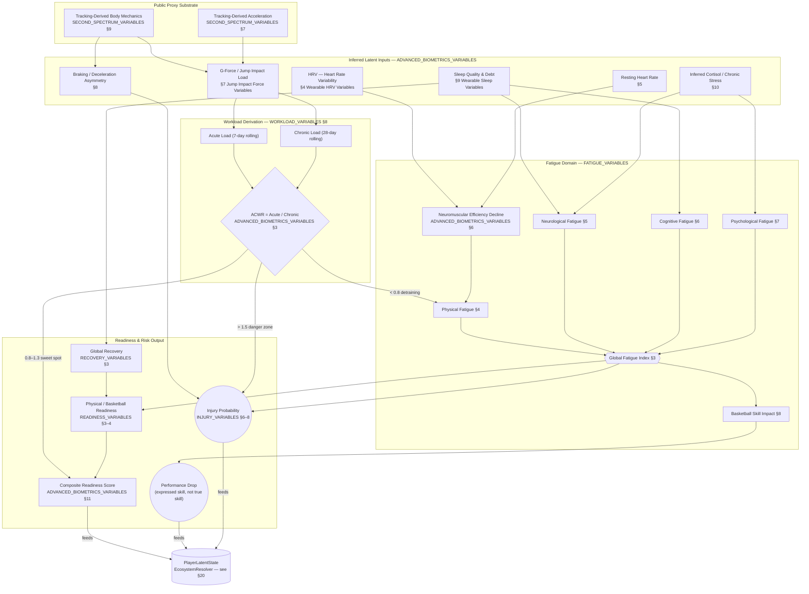
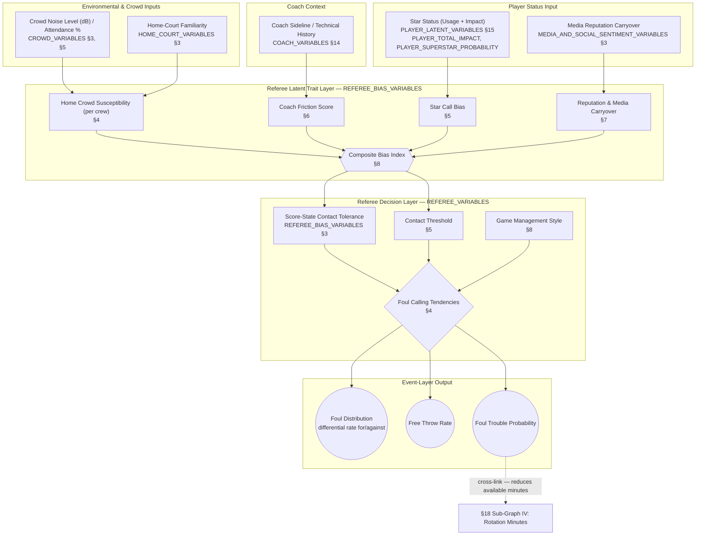
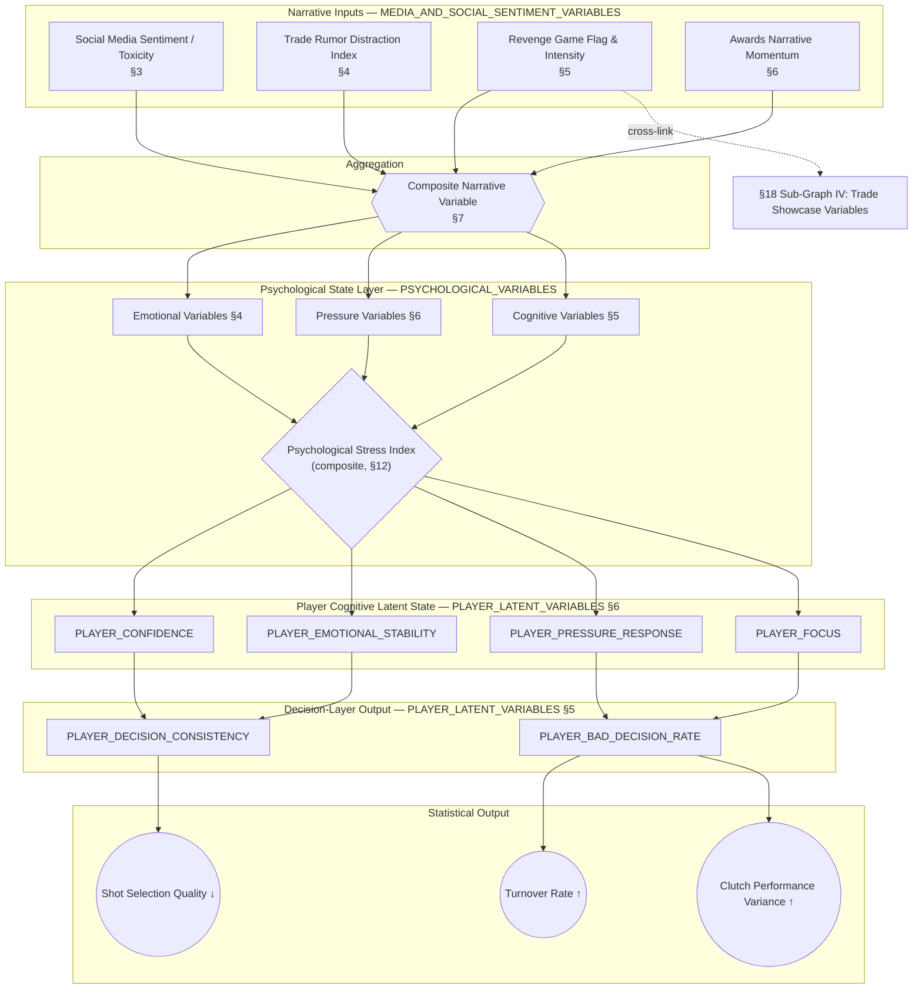
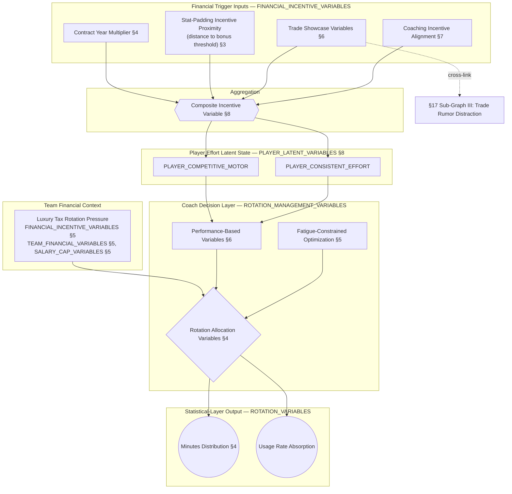
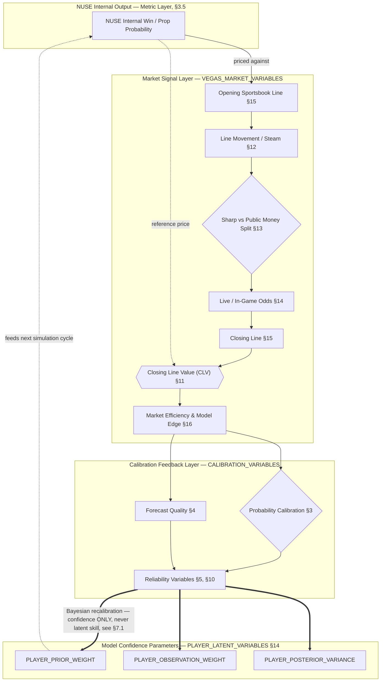
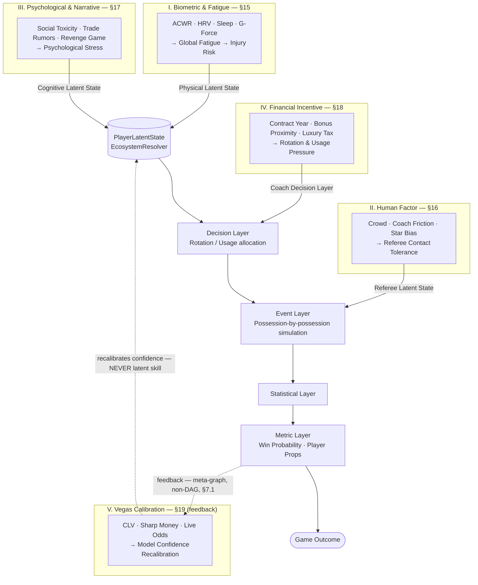

# NUSE Causal Graph

## Purpose

This document defines the causal structure of the NBA Universal Simulation Engine (NUSE).

It specifies **how variables, events, entities, and states influence each other over time**.

The causal graph is the foundation of all prediction and simulation logic.

No statistical model is valid unless it respects this causal structure.

Version 2.0.0 closes **Phase 2 — Causal Mapping**. It preserves every rule established in v1.0.0 and extends the theoretical skeleton with five fully instantiated microscopic sub-graphs, sourced directly from the Phase 1 Variable Ontology (`09_VARIABLES/`), plus a Unified Master Causal Graph showing how these hidden variables converge into a single game outcome.

---

## Version History

| Version | Status | Summary |
|---|---|---|
| 1.0.0 | superseded | Established the theoretical causal skeleton: five causal layers, the DAG constraint, and five conceptual causal chains (shooting, passing, defense, fatigue, injury) expressed without reference to concrete variables. |
| 2.0.0 | **stable (this document)** | Phase 2 — Causal Mapping. Adds the Entity & Layer Attribution Framework (§14) and five fully-mapped Mermaid sub-graphs (§15–§19) connecting the microscopic variables ratified in Phase 1 to the core simulation engines, plus the Unified Master Causal Graph (§20). No rule from v1.0.0 is removed or contradicted — only extended. |

---

# 1. Core Principle

Basketball is a causal system.

Every outcome MUST be the result of prior causes.

No variable may exist without causal ancestry.

No event may occur without causal justification.

This applies as much to microscopic exogenous variables (a wearable HRV reading, a referee's historical friction with a coach, a bonus clause threshold) as it does to on-court basketball actions. **A hidden variable that cannot be wired into this graph SHALL NOT be admitted into NUSE**, per the Documentation Standard's prohibition on hidden dependencies.

---

# 2. Causal Direction

All causal relationships follow a strict direction:

EXOGENOUS / CONTEXTUAL INPUT → LATENT STATE → DECISION → EVENT → STATISTIC → METRIC

This chain SHALL never be reversed.

Phase 1 catalogued the exogenous and contextual variables. Phase 2 (this document) specifies exactly where each one enters the chain above, and through which entity's latent state it must pass.

---

# 3. Primary Causal Layers

The system is structured into five causal layers.

## 3.1 Latent Layer

Represents hidden internal states.

Examples:

- Shooting skill
- Decision quality
- Defensive awareness
- Fatigue
- Confidence
- Injury severity

Latent variables generate probabilities.

---

## 3.2 Decision Layer

Represents choices made by players, coaches, and referees.

Examples:

- Shoot
- Pass
- Drive
- Switch
- Help defense
- Allocate rotation minutes
- Call / withhold a foul

Decisions are probabilistic outputs of latent states.

---

## 3.3 Event Layer

Represents actual basketball actions.

Examples:

- Made shot
- Missed shot
- Turnover
- Assist
- Block
- Foul

Events are realized decisions.

---

## 3.4 Statistical Layer

Represents aggregated results of events.

Examples:

- Points
- Assists
- Rebounds
- Usage
- Minutes Distribution

Statistics are summaries of events.

---

## 3.5 Metric Layer

Represents derived analytical indicators.

Examples:

- PER
- BPM
- VORP
- Win Probability
- Player Prop Probability

Metrics are transformations of statistics.

---

# 4. Core Causal Chains

## 4.1 Shooting Chain

Shooting Skill → Shot Selection → Shot Attempt → Shot Outcome → Points → Efficiency Metrics

---

## 4.2 Passing Chain

Passing Ability → Decision to Pass → Pass Event → Assist / Turnover Outcome → Team Offensive Rating

---

## 4.3 Defensive Chain

Defensive Awareness → Defensive Positioning Decision → Defensive Event (contest, steal, block) → Possession Outcome → Opponent Efficiency

---

## 4.4 Fatigue Chain

Minutes Played → Fatigue Accumulation → Movement Reduction → Decision Quality Decrease → Efficiency Drop → Performance Statistics Change

> **Expanded in §15 (Sub-Graph I).** This chain is the conceptual skeleton; §15 replaces "Minutes Played → Fatigue Accumulation" with the fully mapped biometric causal graph.

---

## 4.5 Injury Chain

Physical Load → Injury Risk Increase → Injury Event Probability → Availability Reduction → Minutes Reduction → Team Performance Impact

> **Expanded in §15 (Sub-Graph I).** "Physical Load" is instantiated below through `ADVANCED_BIOMETRICS_VARIABLES` and `WORKLOAD_VARIABLES`.

---

# 5. Team-Level Causality

Team behavior emerges from aggregated player causality.

Examples:

- Offensive system influences shot selection probabilities
- Coaching decisions influence rotations
- Lineups influence spacing and efficiency
- Chemistry influences decision speed and accuracy

---

# 6. Environmental Causality

External factors affect all internal layers.

Examples:

- Back-to-back games increase fatigue
- Travel distance increases error rates
- Altitude affects stamina
- **Referee tendencies affect foul rates** — expanded in §16 (Sub-Graph II)
- Pace of era affects possession volume

---

# 7. Bidirectional Prohibition

Causality is strictly unidirectional.

Forbidden:

Statistics → changing latent skill directly

Metrics → altering past events

Results → modifying prior causes

Only forward propagation is allowed within the basketball-reality graph.

## 7.1 The Calibration Exception (new in v2.0.0)

Sub-Graph V (§19) introduces a feedback loop between market metrics (Closing Line Value, Sharp Money) and NUSE's own confidence parameters. This is **not** an exception to the rule above — it is a distinct meta-graph:

- The **reality graph** (§2) simulates basketball. It MUST remain a DAG (§9). Market outcomes SHALL NEVER modify a player's latent skill.
- The **calibration graph** (§19) simulates NUSE's own epistemic confidence. It MAY be cyclical, because it does not describe basketball — it describes how much NUSE should trust its own basketball model.

Any implementation that lets §19 write into a `PLAYER_*` latent variable violates this document.

---

# 8. Probabilistic Causality

Not all causal links are deterministic.

Each causal edge has:

- Probability distribution
- Sensitivity weight
- Context modifiers

Example:

Shooting skill → shot success probability

NOT

Shooting skill → fixed outcome

---

# 9. Dependency Graph Structure

The causal system is represented as a Directed Acyclic Graph (DAG) — with the single, explicitly scoped exception of §19's calibration loop (§7.1).

Properties of the reality graph:

- No cycles
- No self-dependency
- No backward influence
- Fully traceable paths

---

# 10. Causal Completeness Rule

Every observed statistic MUST be traceable to:

Latent variables

AND

Decision processes

AND

Event sequences

AND

Context conditions

If any link is missing, the model is invalid. Sub-Graphs I–V (§15–§19) exist specifically to close context-condition gaps that v1.0.0 left implicit (e.g. "referee tendencies," "physical load") without a concrete variable trail.

---

# 11. Aggregation Rule

Higher-level outputs are always aggregates of lower-level outputs:

Events → Statistics → Metrics

No shortcut calculations are allowed.

---

# 12. Time Constraint

Causality is time-bound.

Cause MUST precede effect.

No future state can influence past state.

---

# 13. Explanation Requirement

Every causal path must be explainable in reverse form:

Metric → Statistics → Events → Decisions → Latent states → Exogenous/Contextual origin

This is required for interpretability, and is the reason every node in §15–§20 below carries an explicit source-document reference.

---

# 14. Entity & Layer Attribution Framework

Before mapping the five microscopic sub-graphs, NUSE must answer one question for each of them: **whose latent state does this variable modify, and at which layer does it enter the chain?**

Not every hidden variable modifies the *player's* latent skill. Conflating "context that changes what is observed" with "context that changes what a player actually is" would violate the Observable/Latent/Derived distinction (`00_PROJECT_PHILOSOPHY.md` §9) and would corrupt the traceability chain. The table below is the routing table used by every sub-graph in this document.

| Sub-Graph | Owning Entity | Entry Layer | Does it alter true player skill? |
|---|---|---|---|
| I — Biometric & Fatigue | `ENTITY_PLAYER` (physical state) | Latent (physical) → propagates into cognitive Latent | **Yes**, temporarily — fatigue genuinely degrades expressed skill, it does not merely mask it |
| II — Human Factor (Referees) | `ENTITY_REFEREE` (via `ENTITY_GAME` crew assignment) | Decision → Event | **No** — the player is unchanged; the probability of a foul being *called* changes |
| III — Psychological & Narrative | `ENTITY_PLAYER` (cognitive state) | Latent (cognitive) → Decision | **Yes**, temporarily — stress genuinely degrades decision quality, distinct from Sub-Graph I's physical channel |
| IV — Financial Incentive | `ENTITY_COACH` / `ENTITY_TEAM` (allocation) and `ENTITY_PLAYER` (effort) | Decision (rotation) + Latent (motor/effort) | **Partially** — allocation changes opportunity, not skill; effort variables are a genuine (if temporary) latent shift |
| V — Vegas Calibration | The **model itself** (NUSE's own confidence state) | Post-Metric feedback into confidence parameters only | **No, by construction** — see §7.1 |

This framework is what allows the five sub-graphs below to be composed into one Unified Master Causal Graph (§20) without violating the DAG constraint of §9.

---

# 15. Sub-Graph I — Biometric & Fatigue Causal Graph

## 15.1 Scope

Maps `ADVANCED_BIOMETRICS_VARIABLES`, `FATIGUE_VARIABLES`, `WORKLOAD_VARIABLES`, `RECOVERY_VARIABLES`, `READINESS_VARIABLES`, and `INJURY_VARIABLES` into a single causal chain from raw wearable-proxy signal to injury probability and performance drop.

## 15.2 The Inaccessible Data Rule, applied

Per `00_MISSION_DIRECTIVE.md` Article 3, HRV, G-Force, and sleep telemetry are **not** available from any public NBA data source. NUSE therefore classifies every node in the top layer below as **Latent — Inferred Proxy**, never as `Observable`, even though conceptually they originate from wearable hardware. The inference substrate is `SECOND_SPECTRUM_VARIABLES` (§7 Transition Acceleration, §9 Body Mechanics/Axis) combined with public schedule data (back-to-backs, minutes log) — NUSE never assumes direct API access to team-internal wearable feeds.

## 15.3 Diagram

## 15.4 Node & Relationship Reference

| Node | Formal Reference | Type | Relationship |
|---|---|---|---|
| HRV, RHR | `ADVANCED_BIOMETRICS_VARIABLES` §4–§5 | Latent (Inferred Proxy) | `ESTIMATES` Neuromuscular Efficiency |
| G-Force, Braking Asymmetry | `ADVANCED_BIOMETRICS_VARIABLES` §7–§8 | Latent (Inferred Proxy) | `AFFECTS` Acute Load, `AFFECTS` Injury Probability |
| Sleep, Cortisol | `ADVANCED_BIOMETRICS_VARIABLES` §9–§10 | Latent (Inferred Proxy) | `AFFECTS` Neurological / Psychological Fatigue |
| ACWR | `ADVANCED_BIOMETRICS_VARIABLES` §3 | Derived | `CALCULATES` from Acute/Chronic Load; `AFFECTS` Injury Probability |
| Global Fatigue Index | `FATIGUE_VARIABLES` §3 | Derived (composite) | `AFFECTS` Basketball Skill Impact, Readiness, Injury Probability |
| Composite Readiness Score | `ADVANCED_BIOMETRICS_VARIABLES` §11 | Derived | `GENERATES` input to `PlayerLatentState` |
| Injury Probability | `INJURY_VARIABLES` §6–§8 | Probabilistic | `AFFECTS` Availability (§4.5) |

**Implementation Note (non-normative):** in `nba_omniscient_simulator/latent_state.py`, the Composite Readiness / Skill-Impact pair is currently realized as the `cumulative_physical_load` field of `PlayerLatentState`, consumed by `EcosystemResolver` on every structural recomputation.

**Open item:** `06_FORMULAS_CORE.md` v1.0.0 does not yet define `FORMULA_ACWR` or `FORMULA_GLOBAL_FATIGUE_INDEX`. Recommended as the first follow-up task once this document is merged.

---

# 16. Sub-Graph II — Human Factor Causal Graph (Referees & Environment)

## 16.1 Scope

Maps `CROWD_VARIABLES`, `HOME_COURT_VARIABLES`, `REFEREE_BIAS_VARIABLES`, and `REFEREE_VARIABLES` into the causal path that determines foul-calling behavior. Per §14, this sub-graph modifies the `ENTITY_REFEREE` latent state, **not** the player's.

## 16.2 Diagram

## 16.3 Node & Relationship Reference

| Node | Formal Reference | Type | Relationship |
|---|---|---|---|
| Crowd Noise, Home Familiarity | `CROWD_VARIABLES` §3/§5, `HOME_COURT_VARIABLES` §3 | Observable / Contextual | `AFFECTS` Home Crowd Susceptibility |
| Star Status | `PLAYER_LATENT_VARIABLES` §15 | Derived (composite) | `AFFECTS` Star Call Bias |
| Composite Bias Index | `REFEREE_BIAS_VARIABLES` §8 | Derived (per-crew latent) | `AFFECTS` Contact Threshold, Score-State Tolerance |
| Foul Calling Tendencies | `REFEREE_VARIABLES` §4 | Probabilistic | `GENERATES` Foul event distribution |

This sub-graph terminates at the **Event Layer** (§3.3), not the Latent Layer of `ENTITY_PLAYER` — the player's true defensive/offensive skill is unmodified; only the probability that contact is *whistled* changes. This is the same "Foul" example already listed in §3.3 and §6 of this document; Sub-Graph II is its full expansion.

---

# 17. Sub-Graph III — Psychological & Narrative Causal Graph

## 17.1 Scope

Maps `MEDIA_AND_SOCIAL_SENTIMENT_VARIABLES` and `PSYCHOLOGICAL_VARIABLES` into the cognitive branch of `PLAYER_LATENT_VARIABLES` §6 (Psychological Variables) and §5 (Decision Variables). Distinct from Sub-Graph I: this is a **cognitive**, not physical, degradation channel.

## 17.2 Diagram

## 17.3 Node & Relationship Reference

| Node | Formal Reference | Type | Relationship |
|---|---|---|---|
| Social Media Sentiment | `MEDIA_AND_SOCIAL_SENTIMENT_VARIABLES` §3 | Observable (NLP-scored) | `AFFECTS` Composite Narrative Variable |
| Revenge Game | `MEDIA_AND_SOCIAL_SENTIMENT_VARIABLES` §5 | Categorical / Contextual | `AFFECTS` Composite Narrative Variable |
| Psychological Stress Index | `PSYCHOLOGICAL_VARIABLES` (composite) | Derived | `AFFECTS` `PLAYER_FOCUS`, `PLAYER_PRESSURE_RESPONSE` |
| `PLAYER_DECISION_CONSISTENCY`, `PLAYER_BAD_DECISION_RATE` | `PLAYER_LATENT_VARIABLES` §5 | Latent | `GENERATES` Turnover / Shot-Quality statistical drift |

This sub-graph is the direct expansion of the "Decision Quality Decrease" node already present in §4.4 of this document — Sub-Graph I reaches decision-quality decrease through the *physical* channel, Sub-Graph III reaches the same downstream node through the *cognitive* channel. Both MAY be active simultaneously; `EcosystemResolver` MUST sum, not overwrite, their contributions (§20).

---

# 18. Sub-Graph IV — Financial Incentive Causal Graph

## 18.1 Scope

Maps `FINANCIAL_INCENTIVE_VARIABLES`, `CONTRACT_VARIABLES`, `SALARY_CAP_VARIABLES`, and `TEAM_FINANCIAL_VARIABLES` into the `ENTITY_COACH` rotation-allocation decision (`ROTATION_MANAGEMENT_VARIABLES`) and, secondarily, into the player's own effort variables (`PLAYER_LATENT_VARIABLES` §8, Motor Variables).

## 18.2 Diagram

## 18.3 Node & Relationship Reference

| Node | Formal Reference | Type | Relationship |
|---|---|---|---|
| Contract Year Multiplier | `FINANCIAL_INCENTIVE_VARIABLES` §4 | Derived (temporal) | `AFFECTS` Composite Incentive Variable |
| Luxury Tax Rotation Pressure | `FINANCIAL_INCENTIVE_VARIABLES` §5 | Contextual (team-level) | `AFFECTS` Rotation Allocation Variables directly |
| `PLAYER_COMPETITIVE_MOTOR`, `PLAYER_CONSISTENT_EFFORT` | `PLAYER_LATENT_VARIABLES` §8 | Latent | `AFFECTS` Performance-Based Variables |
| Rotation Allocation Variables | `ROTATION_MANAGEMENT_VARIABLES` §4 | Decision | `GENERATES` Minutes Distribution, Usage Rate |

**Two distinct channels, per §14:** (a) an **allocation channel** — Luxury Tax pressure changes how many minutes a coach is willing to allocate, independent of the player's ability; (b) an **effort channel** — the well-documented "contract year effect" is modeled as a genuine, temporary shift in `PLAYER_COMPETITIVE_MOTOR`/`PLAYER_CONSISTENT_EFFORT`, not as fabricated stats. NUSE MUST keep these two channels separately traceable.

---

# 19. Sub-Graph V — Las Vegas Calibration Feedback Graph

## 19.1 Scope

Maps `VEGAS_MARKET_VARIABLES` and `CALIBRATION_VARIABLES` into a feedback loop against NUSE's own Metric-layer output. Per §7.1 and §14, this sub-graph is the **only** cyclical structure permitted in this document, and it MUST NOT write into any `PLAYER_*` latent variable — only into model confidence parameters (`PLAYER_LATENT_VARIABLES` §14, Reliability Variables).

## 19.2 Diagram

## 19.3 Node & Relationship Reference

| Node | Formal Reference | Type | Relationship |
|---|---|---|---|
| Closing Line Value (CLV) | `VEGAS_MARKET_VARIABLES` §11 | Derived | `VALIDATES` NUSE's Metric-layer output |
| Sharp vs Public Money | `VEGAS_MARKET_VARIABLES` §13 | Observable (market-derived) | `AFFECTS` Line Movement interpretation |
| Probability Calibration | `CALIBRATION_VARIABLES` §3 | Derived | `CALCULATES` from Market Efficiency & Model Edge |
| `PLAYER_PRIOR_WEIGHT`, `PLAYER_OBSERVATION_WEIGHT` | `PLAYER_LATENT_VARIABLES` §14 | Latent (model-confidence, not skill) | `ESTIMATES` — updated by, never overwritten by, market data |

**This is the only permitted loop in the specification.** Any pipeline implementation that lets `EDGE` or `CLV` write directly into a skill-type `PLAYER_*` variable (e.g. `PLAYER_OFFENSIVE_IQ`) is a Documentation Standard violation and MUST be rejected in code review.

---

# 20. Unified Master Causal Graph

This is the synthesis Javi/the Comandante asked for: how do all five hidden-variable domains determine a single game's outcome?

## 20.1 Reading the Master Graph

- **Four converging tributaries, one loop.** Sub-Graphs I, II, III, and IV are strictly forward (DAG-compliant) tributaries that feed the reality simulation at different layers, per the routing table in §14. Sub-Graph V is the single permitted feedback loop (§7.1, §19), operating on model confidence rather than basketball reality.
- **`PlayerLatentState` is the true convergence point** for anything that changes what a player *is* (physical, in `d1`; cognitive, in `d3`). `EcosystemResolver` recomputes downstream expressed outputs whenever either input changes.
- **The Decision and Event layers absorb context that does not touch player identity** — `d2` (referee behavior) and `d4` (coach allocation) are clean examples of context that changes what is *observed* without altering what a player *is*.
- **Every arrow in this diagram is traceable** to a named node in §15–§19, each of which is traceable to a named section of a Phase 1 variable file. This satisfies the Causal Completeness Rule (§10) end to end.

---

# 21. Cross-Domain Interaction Notes

The five domains are not independent in practice. NUSE SHOULD model at minimum the following documented interaction effects, each of which is a composition of two sub-graphs already defined above rather than a new causal primitive:

1. **Contract Year × Revenge Game** (§18 × §17): a player in a contract year facing his former team compounds the effort-channel boost of §18 with the narrative-stress channel of §17. The net effect on decision quality is domain-specific and SHALL be resolved by `EcosystemResolver`, not assumed additive by default.
2. **Star Call Bias × High ACWR** (§16 × §15): referees are documented to extend more caution around visibly fatigued or high-usage stars late in a season; `REFEREE_BIAS_VARIABLES` §5 (Star Call Bias) MAY take `ADVANCED_BIOMETRICS_VARIABLES` readiness state as a contextual modifier.
3. **Trade Rumor Distraction × Trade Showcase** (§17 × §18): the same trade rumor can simultaneously depress focus (§17, `TRD`) and inflate effort as a player auditions for suitors (§18, `TSV`). Both nodes reference the same upstream event and MUST share a single `TRADE_VARIABLES` source-of-truth event, not two independently-sampled ones.
4. **Luxury Tax Pressure × Fatigue** (§18 × §15): a team over the tax line has a direct incentive to rest, not just reward, a fatigued veteran — `ROTATION_MANAGEMENT_VARIABLES` §5 (Fatigue-Constrained Optimization) is the shared node where §15's Global Fatigue Index and §18's Luxury Tax Pressure both terminate.

---

# 22. Extensibility

## 22.1 Adding a Sixth Sub-Graph

A new microscopic domain MAY be added as Sub-Graph VI+ if, and only if, it:

- Declares its source `09_VARIABLES/*.md` file(s) as explicit dependencies in the frontmatter of this document.
- Is assigned a row in the §14 Entity & Layer Attribution Framework before any diagram is drawn.
- Preserves the DAG constraint of §9, or is explicitly scoped as a second calibration-class exception under §7.1.

## 22.2 Recommended Follow-Ups (non-blocking)

- `06_FORMULAS_CORE.md` v1.0.0 does not yet define `FORMULA_ACWR`, `FORMULA_GLOBAL_FATIGUE_INDEX`, `FORMULA_COMPOSITE_BIAS_INDEX`, `FORMULA_COMPOSITE_INCENTIVE_VARIABLE`, or `FORMULA_CLOSING_LINE_VALUE`. Every one of these is referenced as a `Derived` node in §15–§19. Recommended as the next specification task.
- `05_VARIABLES_INDEX.md` should be re-generated to register the cross-file relationships introduced in §14 and §21.

---

# 23. Final Statement

This document defines the complete causal structure of the NUSE system, including the full Phase 2 mapping of biometric, human-factor, psychological, financial, and market-calibration variables onto the core simulation engines.

All future formulas, pipelines, simulations, and predictions MUST comply with this causal graph.

No variable ratified in the Phase 1 Ontology may be consumed by any pipeline until it appears, with an explicit entry layer and owning entity, in this document or a future extension governed by §22.