# NUSE Possession Loop Engine (Phase 8)

## Purpose

This document defines the mathematical theory and algorithmic logic of **the Possession Loop**: the stochastic engine that resolves a single basketball possession, from the moment the ball crosses half-court to its terminal outcome (made shot, missed shot, shooting foul, non-shooting foul, or turnover), inside the NUSE simulation architecture.

It is a **specification**, per `00_SPECIFICATION_LANGUAGE.md` (NSL) §8: mathematical behaviour, required variables, and detailed pseudocode. It intentionally contains **zero infrastructure code**. Translation into hyper-optimized NumPy is explicitly out of scope, owned downstream by the Engineer.

This document exists because two things are simultaneously true of the current codebase: (1) `nba_omniscient_simulator/simulation.py`'s `MonteCarloOrchestrator.run()` currently synthesizes points/rebounds/assists from closed-form Gaussian-noise formulas applied to season-level aggregates — an "honest simplification" the codebase itself flags as a placeholder, not a possession-level simulation; and (2) `RotationEngine.resolve_possession()` already exists but only samples a ball-handler and a rebounder via softmax, always returning `possession_type="half_court"` — it does not resolve a shot, a foul, or a turnover. `domain.py`'s `GameContext` docstring explicitly calls itself "an extension point for a future live re-simulation mode... not yet consumed by `RotationEngine.resolve_possession`." This document is the design that fills that extension point.

## Version History

| Version | Status | Summary |
|---|---|---|
| 1.0.0 | **draft (this document)** | Phase 8, first pass. Defines the full Possession Loop: live-state extension of `GameContext`, six new clash/event formulas (`FORMULA_ACTION_TYPE_SELECTION`, `FORMULA_MATCHUP_CLASH_INDEX`, `FORMULA_POSSESSION_BRANCH_RESOLUTION`, `FORMULA_SHOT_SUCCESS_RESOLUTION`, `FORMULA_FOUL_ADJUDICATION`, `FORMULA_REBOUND_DUEL_RESOLUTION`), two new state-mutator formulas (`FORMULA_ACUTE_INTRAGAME_FATIGUE`, `FORMULA_IN_GAME_MOMENTUM_INDEX`), a Mermaid logical-flow diagram, and master pseudocode. Operationalizes Stage 11–12 of `07_SIMULATION_PIPELINE.md` and the possession lifecycle already declared in `08_ENTITIES/ENTITY_POSSESSION.md` §7. Formalizes placeholder identifiers already declared but undefined in `POSSESSION_VARIABLES.md` §18–§19 and `MATCHUP_ADVANTAGE_VARIABLES.md` §3–§7. |

---

# 1. Position in the Pipeline and Scope

`07_SIMULATION_PIPELINE.md` declares, without mathematical content:

> Stage 11 — Possession Simulation: for each possession, resolve an offensive decision, a defensive reaction, and an event outcome. Output: `POSSESSION_EVENT_SEQUENCE`.
> Stage 12 — Event Generation: generate shot attempts, made/missed shots, assists, turnovers, fouls, blocks, and rebounds via causal formulas. Output: `EVENT_STREAM`.

This document **is** Stages 11–12, made concrete. It is also the executable physics behind the seven-phase possession lifecycle already declared in `08_ENTITIES/ENTITY_POSSESSION.md` §7 (initial state → offensive decision → defensive response → interaction resolution → event generation → state update → possession termination).

Scope boundary: this document governs **one possession**, given an already-resolved offensive and defensive five-man lineup (upstream of `RotationEngine.build_shared_minutes_matrix`) and an already-equilibrated `TeamEcosystemState` (upstream of `EcosystemResolver.equilibrate`). Lineup selection, structural roster equilibration, and season-level aggregation remain out of scope — those are Phases 4–6 and `MonteCarloOrchestrator`'s outer loop, respectively.

---

# 2. Entity & Layer Attribution — Sub-Graph VI

Per `04_CAUSAL_GRAPH.md` §22.1, a new microscopic domain may only be added if it (a) declares its source `09_VARIABLES/*.md` dependencies in the frontmatter — done above — (b) is assigned a row in the §14 Entity & Layer Attribution Framework **before any diagram is drawn**, and (c) preserves the DAG constraint of §9. This section satisfies (b) and (c) before §5 draws the flow diagram.

| Sub-Graph | Owning Entity | Entry Layer | Does it alter true player skill? |
|---|---|---|---|
| VI — Possession Loop (Live State) | `ENTITY_PLAYER` (physical + cognitive, **possession-grain**) and `ENTITY_REFEREE` (adjudication) | Latent (live) → Decision → Event, recurring every possession within a single game | **Yes, temporarily, and only through the live layer** — `IN_GAME_ACUTE_FATIGUE` and `IN_GAME_MOMENTUM_INDEX` are a finer temporal zoom-in on the *same* physical/cognitive channels Sub-Graphs I and III already license as genuine (if temporary) skill-impacting variables. The referee sub-component (§7.4 `FORMULA_FOUL_ADJUDICATION`) is strictly **No**, matching Sub-Graph II exactly. |

**DAG-compliance justification.** The possession-to-possession recursion this document introduces — $A_p(k) \leftarrow A_p(k-1)$, $(\alpha_p^M, \beta_p^M)(k) \leftarrow (\alpha_p^M,\beta_p^M)(k-1)$ — is a first-order Markov state evolution **in time**, structurally identical to the already-licensed $\text{ewma}_\lambda(x_t) = \lambda x_t + (1-\lambda)\,\text{ewma}_\lambda(x_{t-1})$ recursion in `06_FORMULAS_CORE.md` §5.0. It is not a cycle in the causal-**type** graph forbidden by §9: every possession $k$'s inputs causally precede its outputs (§12, Time Constraint), and no downstream Statistic or Metric ever reaches back to overwrite a sealed latent dimension (§7, Bidirectional Prohibition). Sub-Graph VI is therefore a **temporal refinement** of Sub-Graphs I and III, not a sixth independent causal primitive — consistent with how `04_CAUSAL_GRAPH.md` §21 already treats cross-domain compositions as combinations of existing sub-graphs rather than new ones.

---

# 3. Layered State Composition

No possession-level formula in this document computes a player's "power" from scratch. Every one composes four pre-existing or newly-defined layers, from slowest-moving to fastest-moving:

| Layer | Symbol | Source | Update cadence |
|---|---|---|---|
| Sealed Skill | $\vec L_p$ | `PlayerLatentState.as_vector()` (`latent_state.py`) | Immutable within a season; only `LatentAgingEngine` moves it, offseason |
| Structural (Ecosystem) | $E_p$ = `expressed_efficiency[p]`, $D_p$ = `defensive_rating[p]` | `EcosystemResolver.equilibrate()` | Recomputed on structural event (trade / injury / coaching change) |
| Session (Pre-Game) | $F_p^{(0)}$ = `total_fatigue`; $\Psi_p$ = (`player_confidence_adj`, `player_emotional_stability_adj`, `player_pressure_response_adj`, `player_focus_adj`); $\Phi_p$ = (`player_competitive_motor_adj`, `player_consistent_effort_adj`); $\beta^r_p$ = `total_bias_adjustment_index` (dyadic, referee-specific) | `resolve_biometric_fatigue`, `resolve_psychological_stress`, `resolve_financial_distortion`, `resolve_referee_bias` (`ecosystem_resolver.py`) | Once per game (or slower) |
| **Live (In-Game)** | $A_p(t)$ = `IN_GAME_ACUTE_FATIGUE`; $M_p(t)$ = `IN_GAME_MOMENTUM_INDEX` | **This document, §7** | **Every possession** |

Define the per-player bundle consumed by every formula below as:

```latex
\Theta_p(t) = \Big(\ \vec L_p,\quad E_p,\ D_p,\quad F_p^{(0)},\ \Psi_p,\ \Phi_p,\ \beta^r_p,\quad A_p(t),\ M_p(t)\ \Big)
```

An **effective fatigue** blend bridges the Session and Live layers, used throughout §6–§7:

```latex
F_p^{\text{eff}}(t) = \text{clip}\Big(w_{F0}\cdot F_p^{(0)} + (1-w_{F0})\cdot A_p(t),\ 0,\ 1\Big) \qquad w_{F0} = 0.35 \text{ (default, pre-calibration)}
```

This is the possession-loop analog of `06_FORMULAS_CORE.md` §5.0's shared-helper convention: rather than redefine $\sigma(x)$, $\text{clip}(x,a,b)$, or $\text{ewma}_\lambda$, every formula in this document **reuses them by reference**.

---

# 4. The Live State Container

`GameContext` (`domain.py`) is the codebase's own designated extension point. This document proposes extending it — as a **schema sketch**, not an implementation — into a `LIVE_POSSESSION_CONTEXT` carrying everything the loop reads and mutates every possession:

```
PROPOSED SCHEMA (extension of GameContext — not infrastructure code)

LIVE_POSSESSION_CONTEXT:
    team_id, opponent_id                    : str                 (inherited from GameContext)
    score_differential                      : float               (inherited)
    foul_trouble_player_ids                 : list[str]           (inherited)

    game_clock_seconds_remaining            : float               (NEW)
    shot_clock_seconds_remaining            : float               (NEW)
    quarter                                 : int                 (NEW)
    team_fouls                              : dict[team_id -> int]  (NEW, resets each quarter)
    possession_index                        : int                 (NEW)

    acute_fatigue                           : dict[player_id -> float]           A_p(t)   (NEW)
    momentum_params                         : dict[player_id -> (alpha_p^M, beta_p^M)]     (NEW, internal Beta state)
    momentum_index                          : dict[player_id -> float]           M_p(t)   (NEW, derived cache of momentum_params)
    seconds_played_since_rest               : dict[player_id -> float]                     (NEW, drives the recovery branch of §7.1)
```

Everything under `(NEW)` is introduced by this document and is scoped to a **single simulated game** — it is discarded (or, for `acute_fatigue`, partially folded back per §7.1) at final buzzer. Nothing in this section touches `PlayerLatentState`, `TeamEcosystemState`, or `CoachProfile`.


---

# 5. The Logical Flow Diagram

```mermaid
graph TD
    START(("Possession Start<br/>t = POSSESSION_START_TIME")) --> L1

    subgraph INIT["1. Live-State Initialization"]
        L1["Resolve on-court five OFF and five DEF<br/>RotationEngine.build_shared_minutes_matrix"]
        L2["Load Theta_p per player:<br/>sealed skill + structural + session + live(t-)"]
        L3["Read GAME_CLOCK, SHOT_CLOCK, TEAM_FOULS,<br/>SCORE_DIFFERENTIAL -- derive PRESSURE_LEVEL"]
        L1 --> L2 --> L3
    end

    L3 --> D1

    subgraph DECISION["2. Offensive Action Selection -- FORMULA_ACTION_TYPE_SELECTION"]
        D1{"softmax over archetypes:<br/>TRANSITION, PICK_AND_ROLL, ISOLATION,<br/>POST_UP, OFF_BALL_SPOT_UP, RESET"}
    end

    D1 --> A1

    subgraph ASSIGN["3. Primary Duel Assignment"]
        A1["Assign primary defender d*<br/>man/switch scheme -- SWITCH_ADVANTAGE"]
        A2{"Help rotates? HELP(t) ~ Bernoulli<br/>DEFENSIVE_SYNCHRONIZATION"}
        A1 --> A2
    end

    A2 --> C1
    A2 --> C2

    subgraph CLASH["4. THE CLASH -- FORMULA_MATCHUP_CLASH_INDEX"]
        C1["Offensive Power OP(a,t)<br/>skill x structural x fatigue x momentum x stress"]
        C2["Defensive Resistance DR(d,t)<br/>skill x structural x fatigue x scheme x help"]
        C3["MCI(a,d,t) = sigmoid(lambda . (OP - DR))"]
        C1 --> C3
        C2 --> C3
    end

    C3 --> B1

    subgraph BRANCH["5. Branch Resolution -- FORMULA_POSSESSION_BRANCH_RESOLUTION"]
        B1["Competing-risks softmax:<br/>SHOT vs FOUL vs TURNOVER vs RESET"]
        B2{"Monte Carlo draw<br/>u ~ Uniform(0,1)"}
        B1 --> B2
    end

    B2 -->|"RESET"| D1
    B2 -->|"TURNOVER"| TO_OUT
    B2 -->|"FOUL"| F1
    B2 -->|"SHOT"| S1

    subgraph SHOT["6a. Shot Resolution -- FORMULA_SHOT_SUCCESS_RESOLUTION"]
        S1["P(MADE) via sigmoid --<br/>skill, SHOT_CONTEST_ADVANTAGE, fatigue, momentum"]
        S2{"Monte Carlo draw"}
        S1 --> S2
    end

    S2 -->|"MADE"| MADE_OUT
    S2 -->|"MISSED"| R1

    subgraph FOUL["6b. Foul Adjudication -- FORMULA_FOUL_ADJUDICATION"]
        F1["P(CALLED given contact) via sigmoid --<br/>severity + TOTAL_BIAS_ADJUSTMENT_INDEX"]
    end

    F1 --> FT_OUT

    subgraph REB["6c. Rebound Duel -- FORMULA_REBOUND_DUEL_RESOLUTION"]
        R1["softmax across all 10 on-court --<br/>OREB weights vs DREB weights"]
    end

    R1 -->|"OREB"| B1
    R1 -->|"DREB"| DREB_OUT

    MADE_OUT(("PossessionOutcome<br/>MADE_SHOT")) --> M1
    TO_OUT(("PossessionOutcome<br/>TURNOVER")) --> M1
    FT_OUT(("PossessionOutcome<br/>FOUL_SHOOTING")) --> M1
    DREB_OUT(("PossessionOutcome<br/>DEF_REBOUND")) --> M1

    subgraph MUTATORS["7. Post-Possession State Mutation"]
        M1["FORMULA_ACUTE_INTRAGAME_FATIGUE<br/>A_p(k) update for all 10 players"]
        M2["FORMULA_IN_GAME_MOMENTUM_INDEX<br/>Beta-Bernoulli update for involved players"]
        M3["Advance GAME_CLOCK, reset SHOT_CLOCK,<br/>update TEAM_FOULS, SCORE, lineup timers"]
        M1 --> M2 --> M3
    end

    M3 --> ENDPOS(("Possession End<br/>emit EVENT_STREAM -- next possession"))
```



Reading note: `BRANCH -->|"RESET"|` loops back into `DECISION` — this is the mechanism by which a single possession contains multiple *actions* (e.g. a drive-and-kick into a new isolation), matching `ENTITY_POSSESSION.md`'s Decision Phase (15 action archetypes) without requiring a new possession object per touch. `REB -->|"OREB"|` loops back into `BRANCH` (not `DECISION`) directly, since an offensive rebound does not reset the shot clock to 24 (NBA rule: 14s), and does not require re-selecting an action type from scratch — see §6.3's Expected Properties.

---

# 6. The Mathematical Core — Clash and Event Formulas

All six formulas below follow the NSL §8 structure. All reuse, rather than redefine, the shared helpers of `06_FORMULAS_CORE.md` §5.0 ($\sigma(x)$, $\text{clip}(x,a,b)$) and `numerics.softmax(x, temperature)`. Every weight vector below is, per the convention already established in `06_FORMULAS_CORE.md` §5.0, a **provisional uniform-informed prior pending empirical calibration** — none of these coefficients are asserted as final.

## 6.1 FORMULA_ACTION_TYPE_SELECTION

**Purpose.** Select which offensive action archetype the current touch of the possession runs, as a function of personnel, coaching scheme, shot-clock urgency, and game pressure. Operationalizes `POSSESSION_VARIABLES.md` §6 (Offensive Context) and §17 (Tactical Variables).

**Inputs.** `usage_distribution`, `spacing_index`, `pace_index` (`TeamEcosystemState`); `pace_modifier`, `usage_flexibility`, `defensive_scheme_rigidity` (`CoachProfile`, via `CoachModifier`); `shot_clock_seconds_remaining`; `PRESSURE_LEVEL` (derived below); `playmaking_gravity`, `offensive_gravity`, `rim_pressure`, `contact_absorption`, `perimeter_gravity` for on-court offensive players (`PlayerLatentState`).

**Outputs.** `ACTION_TYPE` $\in$ {TRANSITION, PICK_AND_ROLL, ISOLATION, POST_UP, OFF_BALL_SPOT_UP, RESET}; `primary_initiator_id`.

**Formula.**

Derive pressure once per possession (feeds this formula and §6.3):

```latex
\texttt{PRESSURE\_LEVEL}(t) = \sigma\Big(\theta_1\cdot\big|\texttt{SCORE\_DIFFERENTIAL}\big|^{-1}_{\text{clipped}} + \theta_2\cdot\mathbb{1}[\texttt{GAME\_CLOCK\_SECONDS\_REMAINING} < 120]\Big)
```

Per-archetype affinity (unnormalized log-odds), for candidate initiator $h$:

```latex
z_{\text{TRANSITION}} = \phi_1\cdot\texttt{pace\_index} + \phi_2\cdot\mathbb{1}[\text{live-ball start}] - \phi_3\cdot\frac{t_{\text{elapsed}}}{24}
```
```latex
z_{\text{PNR}}(h) = \phi_4\cdot\texttt{playmaking\_gravity}_h + \phi_5\cdot\texttt{defensive\_scheme\_rigidity}
```
```latex
z_{\text{ISO}}(h) = \phi_6\cdot\texttt{offensive\_gravity}_h + \phi_7\cdot\big(1-\texttt{usage\_flexibility}\big)
```
```latex
z_{\text{POST\_UP}}(h) = \phi_8\cdot\texttt{rim\_pressure}_h\cdot\texttt{contact\_absorption}_h
```
```latex
z_{\text{OFF\_BALL}} = \phi_9\cdot\texttt{spacing\_index}
```
```latex
z_{\text{RESET}} = \phi_{10}\cdot\mathbb{1}\big[\texttt{shot\_clock\_seconds\_remaining} > 18\big]
```

Note `z_{POST\_UP}` is a **product**, not a sum, of `rim_pressure` and `contact_absorption` — deliberately: a player strong in exactly one of the two should not receive full post-up credit; the archetype requires both jointly. This is the first of several intentionally non-linear (non-additive) interactions in this document, per your requirement not to treat variables as independently linear contributors.

```latex
\vec P_{\text{action}} = \text{softmax}\big(\vec z \,/\, \tau_{\text{action}}\big), \qquad \tau_{\text{action}} = \texttt{CoachModifier.usage\_softmax\_temperature()}
```
```latex
\texttt{ACTION\_TYPE}(k) \sim \text{Categorical}(\vec P_{\text{action}})
```

`primary_initiator_id` is drawn by the same softmax-over-latent-weights mechanism already prototyped in `RotationEngine.resolve_possession`'s `usage_weights` (currently `0.65·playmaking_gravity + 0.35·processing_speed`), generalized to be **archetype-conditioned**: for `ISOLATION`, reweight toward `offensive_gravity`; for `POST_UP`, toward `rim_pressure × contact_absorption`; for `PICK_AND_ROLL`, toward `playmaking_gravity`; etc. — using each archetype's own $z(h)$ expression above as the softmax logits over the five offensive players.

**Expected Properties.**
- $\vec P_{\text{action}}$ sums to 1; every entry in $(0,1)$.
- $z_{\text{RESET}}$ is strictly decreasing in elapsed shot-clock time by construction (it is gated to zero once `shot_clock_seconds_remaining ≤ 18`), which combined with §6.3's hard termination rule guarantees the action loop cannot cycle indefinitely.
- Deterministic given a fixed `rng` seed and fixed inputs (NSL §8, reproducibility).

**Validation Strategy.** Once real play-by-play is ingested (per your stated sequencing — history import follows this phase), compare simulated `ACTION_TYPE` frequency distribution per team against Second Spectrum / Synergy empirical play-type frequency splits.

## 6.2 FORMULA_MATCHUP_CLASH_INDEX

**Purpose.** Resolve the instantaneous clash between an offensive actor's fully-composed power and a defender's fully-composed resistance for the current action type, producing the single advantage index that governs every downstream branch probability in the possession. This is the direct answer to your Requirement #2. Operationalizes `MATCHUP_ADVANTAGE_VARIABLES.md` §3–§7 and `POSSESSION_VARIABLES.md` §18 (`POSSESSION_DIFFICULTY`, `EXECUTION_QUALITY`).

**Inputs.** $\Theta_a$ (attacker bundle, §3), $\Theta_d$ (defender bundle); `ACTION_TYPE`; `HELP(t)` (Bernoulli draw, §6.2 Step 3); `CoachModifier.scheme_matchup_bonus`.

**Outputs.** `MATCHUP_CLASH_INDEX(a,d,t)` $\in (0,1)$; component outputs `OFFENSIVE_POWER(a,t)`, `DEFENSIVE_RESISTANCE(d,t)` exposed for traceability (NSL §19, Traceability).

**Formula.**

*Step 1 — action-conditioned offensive skill blend* (worked examples; remaining archetypes follow the identical construction and are left to `CALIBRATION_VARIABLES`-driven fitting, matching the "provisional" disclaimer pattern of `06_FORMULAS_CORE.md` §5.0):

```latex
\text{SGE}_a(\text{ACTION\_TYPE}) = \vec w^{\text{off}}_{\text{ACTION\_TYPE}} \cdot \vec L_a
```
```latex
\vec w^{\text{off}}_{\text{ISOLATION}} = \big(0.45\,\text{off\_grav},\ 0.10\,\text{play\_grav},\ 0.20\,\text{perim\_grav},\ 0.15\,\text{rim\_press},\ 0,\ 0,\ 0,\ 0.10\,\text{proc\_speed},\ 0\big)
```
```latex
\vec w^{\text{off}}_{\text{POST\_UP}} = \big(0.10,\ 0,\ 0,\ 0.40\,\text{rim\_press},\ 0.35\,\text{contact\_abs},\ 0,\ 0,\ 0,\ 0.15\,\text{pos\_flex}\big)
```
```latex
\vec w^{\text{off}}_{\text{PNR (handler)}} = \big(0.15,\ 0.45\,\text{play\_grav},\ 0.15,\ 0.05,\ 0,\ 0,\ 0,\ 0.20\,\text{proc\_speed},\ 0\big)
```

*Step 2 — Offensive Power, folding structural, session, and live layers multiplicatively:*

```latex
OP(a,t) = \Big[w_E\cdot E_a + (1-w_E)\cdot \text{SGE}_a(\text{action})\Big] \cdot \big(1-\kappa_F\cdot F_a^{\text{eff}}(t)\big) \cdot \big(1+\kappa_M\cdot M_a(t)\big) \cdot \big(1-\eta_\Psi\cdot(1-\Psi_a^{\text{focus}})\big)
```

where $\Psi_a^{\text{focus}} = \texttt{player\_focus\_adj}$ (`PsychologicalStressResult`), $w_E=0.6$, $\kappa_F=0.35$, $\kappa_M=0.20$, $\eta_\Psi=0.15$ (provisional).

*Step 3 — action-conditioned defensive skill blend and Help gate:*

```latex
\text{SGD}_d(\text{ACTION\_TYPE}) = \vec w^{\text{def}}_{\text{ACTION\_TYPE}} \cdot \vec L_d
```

For perimeter-driven actions (ISOLATION, PICK_AND_ROLL, OFF_BALL_SPOT_UP): weight `lateral_mobility` + `defensive_iq`. For interior actions (POST_UP): weight `contact_absorption` + `defensive_iq`.

```latex
\text{HELP}(t) \sim \text{Bernoulli}\big(\sigma(\varsigma_1\cdot\texttt{DEFENSIVE\_SYNCHRONIZATION} - \varsigma_2\cdot\texttt{defensive\_scheme\_rigidity})\big)
```

*Step 4 — Defensive Resistance:*

```latex
DR(d,t) = \Big[w_D\cdot D_d + (1-w_D)\cdot\text{SGD}_d(\text{action})\Big] \cdot \big(1-\kappa_F\cdot F_d^{\text{eff}}(t)\big) \cdot \texttt{CoachModifier.scheme\_matchup\_bonus}(\texttt{lateral\_mobility}_d) \cdot \big(1+\kappa_{\text{help}}\cdot\text{HELP}(t)\big)
```

$w_D=0.6$, $\kappa_{\text{help}}=0.25$ (provisional).

*Step 5 — The Clash:*

```latex
\Delta(a,d,t) = OP(a,t) - DR(d,t)
```
```latex
\texttt{MATCHUP\_CLASH\_INDEX}(a,d,t) = \sigma\big(\lambda_{\text{mci}}\cdot\Delta(a,d,t)\big)
```

reusing the shared $\sigma(x)$ helper of `06_FORMULAS_CORE.md` §5.0; $\lambda_{\text{mci}}=4.0$ (provisional sharpness constant).

**Expected Properties.**
- $\texttt{MATCHUP\_CLASH\_INDEX} \in (0,1)$; equals $0.5$ exactly when $\Delta=0$ (a perfectly even matchup).
- Strictly increasing in $OP$, strictly decreasing in $DR$.
- `total_bias_adjustment_index`, `total_financial_distortion_index`'s allocation channel, and any Vegas-calibration variable are **explicitly absent** from this formula's input set. Per §2's Entity & Layer Attribution row, bias belongs to the adjudication layer, not the true-capability layer — it enters **only** at §6.5.
- $\text{HELP}(t)>0$ strictly lowers the realized clash advantage without modifying any individual defender's own $\text{SGD}_d$ — a genuine team-defense concept, not a single-defender stat inflation.

**Validation Strategy.** Regress simulated `EXECUTION_QUALITY` (proxied by whether the possession terminates in a shot classified as high-quality per `SHOT_VARIABLES.md` §11–§12) against `MATCHUP_CLASH_INDEX`, once real shot-quality data is available.

## 6.3 FORMULA_POSSESSION_BRANCH_RESOLUTION

**Purpose.** At each action-loop iteration, resolve whether the possession terminates now (SHOT, FOUL, TURNOVER) or continues into a new action (RESET), as one joint competing-risks draw rather than three independently-sampled coin flips (which would leak probability mass). Generalizes `FORMULA_SHOT_DECISION_PROBABILITY` and `FORMULA_TURNOVER_PROBABILITY` (`06_FORMULAS_CORE.md` §3.1, §3.3) into a normalized joint distribution, operationalizing `POSSESSION_VARIABLES.md` §9 and §12.

**Inputs.** `MATCHUP_CLASH_INDEX`; `shot_clock_seconds_remaining`; `processing_speed_a`; `player_focus_adj_a`; `DISCIPLINE_ADVANTAGE(d)` (`MATCHUP_ADVANTAGE_VARIABLES.md` §5); reset counter $n_{\text{reset}}$ this possession; $N_{\max}$ (hard cap, default 4).

**Outputs.** `BRANCH` $\in$ {SHOT, FOUL, TURNOVER, RESET}.

**Formula.**

```latex
z_{\text{SHOT}} = \xi_1\cdot\texttt{MATCHUP\_CLASH\_INDEX} + \xi_2\cdot\Big(1-\frac{\texttt{shot\_clock\_seconds\_remaining}}{24}\Big)
```
```latex
z_{\text{TURNOVER}} = \xi_3\cdot(1-\texttt{MATCHUP\_CLASH\_INDEX}) + \xi_4\cdot F_a^{\text{eff}}(t) + \xi_5\cdot(1-\texttt{player\_focus\_adj}_a) - \xi_6\cdot\texttt{processing\_speed}_a
```
```latex
z_{\text{FOUL}} = \xi_7\cdot\texttt{MATCHUP\_CLASH\_INDEX}\cdot\big(1-\texttt{DISCIPLINE\_ADVANTAGE}_d\big)
```
```latex
z_{\text{RESET}} = \xi_8\cdot\mathbb{1}[n_{\text{reset}} < N_{\max}]\cdot\frac{\texttt{shot\_clock\_seconds\_remaining}}{24}
```
```latex
\vec P_{\text{branch}} = \text{softmax}(\vec z \,/\, \tau_{\text{branch}}), \qquad \texttt{BRANCH}(k) \sim \text{Categorical}(\vec P_{\text{branch}})
```

**Expected Properties.**
- **Termination guarantee (hard rule, not merely probabilistic):** when $n_{\text{reset}} \ge N_{\max}$ **or** `shot_clock_seconds_remaining` $< \epsilon_{\text{clock}}$ (default 2s), $z_{\text{RESET}}$ is masked to $-\infty$ before the softmax, forcing $P_{\text{RESET}} \to 0$. This is what guarantees the action loop in §5/§8 halts in finite steps — a numerical enforcement, not a hope.
- On an offensive-rebound re-entry (§6.6), `BRANCH` is re-drawn directly (bypassing §6.1's archetype re-selection) since the shot clock did not reset to 24 — see the flow diagram's reading note in §5.
- $\vec P_{\text{branch}}$ sums to 1.

**Validation Strategy.** Aggregate simulated {SHOT, FOUL, TURNOVER} rates per 100 possessions against known league-average benchmarks (turnover rate roughly 12–15% of possessions; shooting-foul rate roughly 5–8%) as a first-pass sanity check, ahead of full historical calibration.

## 6.4 FORMULA_SHOT_SUCCESS_RESOLUTION

**Purpose.** Extends `FORMULA_SHOT_SUCCESS_PROBABILITY` (`06_FORMULAS_CORE.md` §4.1) by making its previously-abstract `CONTEST_LEVEL` and `CONFIDENCE` inputs concrete functions of this possession's `MATCHUP_CLASH_INDEX` and `IN_GAME_MOMENTUM_INDEX` — closing a loop the original formula left open, per the Composition Rule (`06_FORMULAS_CORE.md` §10).

**Inputs.** Existing: shooting-skill-by-shot-type, shot distance/classification (`SHOT_VARIABLES.md` §4–§5); NEW: `MATCHUP_CLASH_INDEX`, `IN_GAME_MOMENTUM_INDEX`, $F_a^{\text{eff}}(t)$.

**Outputs.** `P(SHOT_MADE)` — instantiates the output type already declared in `POSSESSION_VARIABLES.md` §19.

**Formula.**

```latex
\texttt{CONTEST\_LEVEL}(t) = 1 - \texttt{MATCHUP\_CLASH\_INDEX}(a,d,t)
```
```latex
\texttt{CONFIDENCE}(t) = \texttt{player\_confidence\_adj}_a \cdot \big(1+\kappa_{\text{mom}}\cdot M_a(t)\big)
```
```latex
P(\texttt{SHOT\_MADE}) = \sigma\Big(b_0 + b_1\cdot\texttt{shooting\_skill}(\text{shot\_type}) - b_2\cdot\texttt{CONTEST\_LEVEL}(t) - b_3\cdot F_a^{\text{eff}}(t) + b_4\cdot\texttt{CONFIDENCE}(t)\Big)
```

where `shooting_skill(shot_type)` selects the relevant latent dimension by shot location (`SHOT_VARIABLES.md` §5): `rim_pressure` at the rim, `perimeter_gravity` beyond the arc, a 50/50 blend at mid-range. $\kappa_{\text{mom}}=0.25$ (provisional).

**Expected Properties.**
- Monotonically decreasing in `CONTEST_LEVEL` and in fatigue; increasing in skill and confidence.
- A player at league-average `MATCHUP_CLASH_INDEX` (0.5) and league-average fatigue/confidence reproduces the *unmodified* shooting-skill baseline — i.e. this formula is a strict refinement, not a departure, of §4.1's original.

**Validation Strategy.** Same as `06_FORMULAS_CORE.md` §4.1's own Validation Strategy, with the addition of checking that simulated FG% varies with `CONTEST_LEVEL` in the direction and rough magnitude of published "shot quality vs. defender distance" studies.

## 6.5 FORMULA_FOUL_ADJUDICATION

**Purpose.** Model the referee's *call* decision given that physical contact occurred — strictly downstream of, and separate from, the true clash outcome. This is the **only** formula in this document that consumes `total_bias_adjustment_index`, per §2's Entity & Layer Attribution row for Sub-Graph II ("does it alter true player skill? No — the probability of a foul being called changes").

**Inputs.** `rim_pressure_a`, `contact_absorption_a`, `contact_absorption_d` (physical, bias-free "how much contact really happened" term); `total_bias_adjustment_index(referee, player, coach, game)` (`RefereeBiasResult`, `resolve_referee_bias`); `DISCIPLINE_ADVANTAGE(d)`.

**Outputs.** `P(FOUL_CALLED | contact_generated)`; `fouled_player_id`; `FOUL_TYPE` $\in$ {SHOOTING, NON_SHOOTING}.

**Formula.**

```latex
\texttt{contact\_severity}(a,d) = \zeta_1\cdot\texttt{rim\_pressure}_a + \zeta_2\cdot\texttt{contact\_absorption}_a - \zeta_3\cdot\texttt{contact\_absorption}_d
```
```latex
P(\texttt{FOUL\_CALLED}\mid\text{contact}) = \sigma\Big(\gamma_0 + \gamma_1\cdot\texttt{contact\_severity}(a,d) + \gamma_2\cdot\texttt{total\_bias\_adjustment\_index}(r,a,c,g)\Big)
```

**Expected Properties.**
- `total_bias_adjustment_index` appears **exactly once**, and only here, across every formula in this document — this is an enforceable constraint (see §11), mirroring exactly how `06_FORMULAS_CORE.md` §9 restricts `FORMULA_CONFIDENCE_RECALIBRATION`'s write-set.
- `contact_severity` is computed **without** any bias term — a "what actually happened, physically" quantity — before bias is allowed to touch the *call* probability. Reordering these two steps would violate §2's DAG-compliance justification.

**Validation Strategy.** Compare simulated shooting-foul draw rates by shot type against `SHOT_VARIABLES.md` §13 (Result Variables) empirical baselines, once ingested; compare bias sensitivity ($\partial P / \partial \gamma_2$) against `REFEREE_BIAS_VARIABLES` documented effect sizes.

## 6.6 FORMULA_REBOUND_DUEL_RESOLUTION

**Purpose.** Extends `FORMULA_REBOUND_PROBABILITY` (`06_FORMULAS_CORE.md` §4.3) from an implicit 1-v-1 duel to the full ten-player competing softmax, reusing exactly the weighting already prototyped in `RotationEngine.resolve_possession`'s current placeholder (`0.5·contact_absorption + 0.5·rim_pressure`), extended with a defensive-side term and live fatigue.

**Formula.**

```latex
\text{OREB\_weight}(p) = \big(0.5\cdot\texttt{contact\_absorption}_p + 0.5\cdot\texttt{rim\_pressure}_p\big)\cdot\big(1-\kappa_F\cdot F_p^{\text{eff}}(t)\big), \quad p \in \text{offense}
```
```latex
\text{DREB\_weight}(p) = \big(0.6\cdot\texttt{defensive\_iq}_p + 0.4\cdot\texttt{contact\_absorption}_p\big)\cdot\big(1-\kappa_F\cdot F_p^{\text{eff}}(t)\big)\cdot 1.15, \quad p \in \text{defense}
```

(the $1.15$ constant is the well-documented defensive box-out positional advantage; provisional, same as every other constant in this document).

```latex
\vec P_{\text{rebound}} = \text{softmax}\big(\text{concat}(\text{OREB\_weight}, \text{DREB\_weight})\big), \qquad \texttt{rebounder\_id} \sim \text{Categorical}(\vec P_{\text{rebound}})
```

`rebound_type` (OFFENSIVE / DEFENSIVE) is read off directly from which side the sampled `rebounder_id` belongs to.

**Expected Properties.** $\vec P_{\text{rebound}}$ has 10 entries summing to 1; defensive entries carry a structural edge (the $1.15$ multiplier) reflecting real NBA defensive-rebound-rate dominance (~70–75% league-wide), which the *provisional* constant should approximately reproduce once weights are of comparable scale — an explicit target for the calibration pass.

**Validation Strategy.** Compare simulated team OREB% against league-average bands (~25–30%) as an initial sanity check.


---

# 7. State Mutators — Post-Possession Update

This section is the direct answer to your Requirement #3. It deliberately uses **two different mathematical formalisms** for the two phenomena you named together, because they are different kinds of process: acute fatigue is a physiological load/recovery process (a bounded leaky-integrator), while in-game psychological inertia is a genuine belief-updating process (a discounted conjugate Bayesian filter). Presenting both as if they were the same equation would understate what's actually going on in either one.

## 7.1 FORMULA_ACUTE_INTRAGAME_FATIGUE

**Purpose.** Model how a player's *live*, possession-granular fatigue accumulates during a game and recovers on the bench, using `TOTAL_FATIGUE`'s pre-game value (`06_FORMULAS_CORE.md` §5.1.2) as its $t=0$ initial condition. Operationalizes `FATIGUE_IMPACT` (`POSSESSION_VARIABLES.md` §18), at a temporal resolution `FORMULA_GLOBAL_FATIGUE_INDEX` was never designed to operate at (its own `Required Variables` are scoped to `PLAYER_ID, GAME_ID, TIMESTAMP` — once-per-game granularity, not once-per-possession).

**Inputs.** $A_p(k-1)$ (previous value; $A_p(0) := F_p^{(0)}$ = `total_fatigue` from `resolve_biometric_fatigue`); possession-level load signal (`sprint/transition` flag, `contact_event` flag, `possession_duration_seconds`); `CoachModifier.wear_multiplier(is_top_rotation_player)`; bench time $\Delta t_{\text{bench}}(k)$ since last on-court possession, if applicable.

**Outputs.** $A_p(k)$ = `IN_GAME_ACUTE_FATIGUE` $\in [0,1]$.

**Formula.**

*Incremental load for possession $k$, for a player who was on court:*

```latex
\ell_p(k) = \iota_1\cdot\mathbb{1}[\text{sprint\_or\_transition}] + \iota_2\cdot\mathbb{1}[\text{contact\_event}] + \iota_3\cdot\texttt{possession\_duration\_seconds}(k)
```
```latex
\ell_p(k) \leftarrow \ell_p(k) \cdot \texttt{CoachModifier.wear\_multiplier}(\text{is\_top\_rotation}_p)
```

*Bounded recursive update — accumulates while playing, recovers while benched:*

```latex
A_p(k) = \text{clip}\Big(A_p(k-1) + \iota_0\cdot\ell_p(k) - \mu_0\cdot\Delta t_{\text{bench}}(k),\ 0,\ 1\Big)
```

For a player who did **not** appear in possession $k$ (on the bench), $\ell_p(k)=0$ and only the recovery term applies — this is what makes rest actually restorative in the simulation rather than fatigue being a monotonic one-way ratchet. Provisional constants: $\iota_0=0.08$, $\iota_1=0.30$, $\iota_2=0.25$, $\iota_3=0.02\text{/sec}$, $\mu_0=0.015\text{/sec}$.

*End-of-game bridge back into the sealed architecture (the only sanctioned one):*

```latex
\Delta_{\text{career}} = \rho \cdot \big(A_p(\text{final buzzer}) - A_p(0)\big), \qquad \rho \in (0,1) \text{ (default } 0.10\text{)}
```

then call the **existing**, already-licensed `player.with_wear(Δ_career)` (`latent_state.py`) — exactly the method the sealed class already exposes for this purpose. No new mutation pathway into `PlayerLatentState` is introduced; this formula's job ends the moment it hands a scalar to a method that already existed before this document.

**Expected Properties.**
- $A_p(k) \in [0,1]$ by construction (clipped).
- This formula's only legal output is `IN_GAME_ACUTE_FATIGUE`. It MUST NOT write to any of the nine sealed dimensions of `PlayerLatentState` directly, and MUST NOT write to `cumulative_physical_load` except through the single end-of-game `with_wear()` call above — never mid-game.
- Recovers monotonically during bench time, accumulates monotonically during floor time — the two branches are mutually exclusive per possession per player, never blended.

**Validation Strategy.** Check that simulated $A_p(t)$ trajectories qualitatively reproduce known within-game fatigue curves (a monotonic-with-noise rise across a heavy-minutes stretch, a visible dip after a substitution), and that $\Delta_{\text{career}}$ aggregated over a back-to-back correlates with real reported next-day soreness/exertion proxies once available.

## 7.2 FORMULA_IN_GAME_MOMENTUM_INDEX

**Purpose.** Model "hot hand" / "cold stretch" belief as a genuine, discounted Bayesian update — not a moving average dressed up in Bayesian language. Operationalizes `MOMENTUM_VARIABLES.md` §4 (Player Momentum), §7 (Psychological Variables), and §11 (Propagation Variables).

**Inputs.** Prior game-day mean success rate for the relevant event family (derived from $E_p$, `expressed_efficiency`); sequence of event outcomes $y_k \in \{0,1\}$ (e.g. shot made/missed) attributable to player $p$; discount factor $\delta$.

**Outputs.** $M_p(k)$ = `IN_GAME_MOMENTUM_INDEX`, zero-centered; internal state $(\alpha_p^M(k), \beta_p^M(k))$.

**Formula.**

*Prior at tip-off, calibrated so the Beta mean equals the player's expected baseline rate:*

```latex
\alpha_p^M(0) = \nu_0\cdot E_p, \qquad \beta_p^M(0) = \nu_0\cdot(1-E_p), \qquad \nu_0 = 8 \text{ (prior concentration, provisional)}
```

*Discounted conjugate update after each relevant outcome $y_k$:*

```latex
\alpha_p^M(k) = \delta\cdot\alpha_p^M(k-1) + y_k, \qquad \beta_p^M(k) = \delta\cdot\beta_p^M(k-1) + (1-y_k), \qquad \delta \in (0,1]\ \text{(default } 0.94\text{)}
```

The discount $\delta<1$ is a **forgetting factor** (a standard technique in online/discounted Bayesian filtering): without it, a player's 1st-quarter cold stretch would carry the same weight as their 4th-quarter form, which contradicts the everyday meaning of "momentum." With it, recent evidence dominates while old evidence never fully vanishes.

*Momentum index — deviation from the player's own prior baseline, not an absolute rate:*

```latex
M_p(k) = \frac{\alpha_p^M(k)}{\alpha_p^M(k)+\beta_p^M(k)} - \frac{\alpha_p^M(0)}{\alpha_p^M(0)+\beta_p^M(0)}
```

$M_p(k) > 0$ means genuinely outperforming their own expected baseline right now (hot); $M_p(k) < 0$ means underperforming it (cold). This is the value consumed by §6.2's `OP(a,t)` and §6.4's `CONFIDENCE(t)`.

**Expected Properties.**
- $M_p(k) \in (-1, 1)$, and $M_p(0) = 0$ exactly (no momentum at tip-off, by construction).
- This formula's only legal outputs are `IN_GAME_MOMENTUM_INDEX` and its internal $(\alpha_p^M,\beta_p^M)$ state — see §7.3.
- Optional extension (flagged, not derived here, to keep this document's scope bounded): a small "contagion" term propagating a fraction of $M_p(k)$ into a shared `TEAM_MOMENTUM` aggregate, per `MOMENTUM_VARIABLES.md` §11 (Propagation Variables) and §3 (Team Momentum) — left for a v1.1.0 follow-up (§12).

**Validation Strategy.** Test against the actual empirical basketball-analytics literature on hot-hand effects (which finds a real, if modest, effect once proper sequential-dependence statistics are used) — the discount $\delta$ is the knob to calibrate against that literature's effect-size estimates, not against fan intuition.

## 7.3 Legality / Write-Set Recap

Per the enforcement pattern already established by `06_FORMULAS_CORE.md` §9 (Formula Rules), this document's two mutators are bound by:

| Formula | Sole Legal Output(s) | Forbidden |
|---|---|---|
| `FORMULA_ACUTE_INTRAGAME_FATIGUE` | `IN_GAME_ACUTE_FATIGUE` (live); `cumulative_physical_load` **only** via the end-of-game `with_wear()` bridge | Any write to the nine sealed `PlayerLatentState` dimensions; any mid-game write to `cumulative_physical_load` |
| `FORMULA_IN_GAME_MOMENTUM_INDEX` | `IN_GAME_MOMENTUM_INDEX`, $(\alpha_p^M,\beta_p^M)$ (live, discarded at final buzzer) | Any write to `player_confidence_adj` or any other Session-layer variable computed by `resolve_psychological_stress`; any write to sealed skill dimensions |

Any implementation that lets either formula write into a skill-type `PLAYER_*` latent variable, or into another formula's declared output, is a Documentation Standard violation per the same rule that already governs `FORMULA_CONFIDENCE_RECALIBRATION` (`06_FORMULAS_CORE.md` §5.5.2) — and MUST be rejected on the same grounds.

## 7.4 Non-Conflation Note

`FORMULA_IN_GAME_MOMENTUM_INDEX` (§7.2) and `FORMULA_CONFIDENCE_RECALIBRATION` (`06_FORMULAS_CORE.md` §5.5.2) both use precision-weighted / conjugate Bayesian updating as their mathematical **pattern**. They are otherwise unrelated and MUST NOT be merged, aliased, or allowed to share state:

- `FORMULA_CONFIDENCE_RECALIBRATION` updates **the model's own epistemic trust** in its predictions relative to Vegas closing lines (`PLAYER_PRIOR_WEIGHT`, `PLAYER_OBSERVATION_WEIGHT`, `PLAYER_POSTERIOR_VARIANCE`) — it lives entirely in `04_CAUSAL_GRAPH.md`'s calibration meta-graph (§7.1, §19), which is explicitly permitted to be cyclical because it does not describe basketball.
- `FORMULA_IN_GAME_MOMENTUM_INDEX` updates **a player's in-game hot-hand belief** — it lives in the reality graph (this document's Sub-Graph VI, §2), which MUST remain acyclic in the causal-type sense (its only recursion is the licensed temporal one, per §2's DAG-compliance justification).

Sharing the same two Greek letters across both would be a notational accident, not a semantic link; this document uses $\alpha_p^M,\beta_p^M$ (superscript $M$) throughout precisely to keep the two visually and referentially distinct.

---

# 8. Master Pseudocode

This is the algorithmic backbone the Engineer translates to NumPy. It is written as pseudocode — `FUNCTION`/`FOR EACH`/`IF`/`SAMPLE` keywords, not importable Python — deliberately, per your constraint. Every step names the formula (§6/§7) that resolves it.

```
ALGORITHM resolve_possession_v2

INPUT:
    offense_five, defense_five   : list[PlayerLatentState]      -- the on-court ten
    offense_team_state, defense_team_state : TeamEcosystemState  -- structural layer (equilibrated)
    offense_coach, defense_coach : CoachProfile
    session_layer                : map[player_id -> SessionSnapshot]  -- §3 Session row, from EcosystemResolver Phase 5
    live_state                   : LIVE_POSSESSION_CONTEXT        -- §4
    referee_bias_lookup          : map[(referee_id, player_id, coach_id, game_id) -> RefereeBiasResult]
    rng                          : np.random.Generator            -- the SAME generator instance used everywhere else

OUTPUT:
    outcome     : POSSESSION_OUTCOME_V2   -- §9
    live_state' : LIVE_POSSESSION_CONTEXT  -- a new, mutated copy -- never mutated in place (§7.3)

----------------------------------------------------------------------
STEP 1 -- INITIALIZE
----------------------------------------------------------------------
    theta <- BUILD_THETA(offense_five, defense_five, offense_team_state,
                          defense_team_state, session_layer, live_state)      -- §3
    pressure_level <- DERIVE_PRESSURE_LEVEL(live_state.score_differential,
                                             live_state.game_clock_seconds_remaining)   -- §6.1
    n_reset <- 0
    event_sequence <- []

----------------------------------------------------------------------
STEP 2 -- ACTION LOOP  (one iteration = one FORMULA_POSSESSION_BRANCH_RESOLUTION draw;
          RESET re-enters at the top, OREB re-enters at the BRANCH sub-step)
----------------------------------------------------------------------
    LOOP:
        action_type, initiator_id <- SAMPLE_ACTION_TYPE(
            theta, offense_coach, live_state.shot_clock_seconds_remaining,
            pressure_level, rng)                                      -- FORMULA_ACTION_TYPE_SELECTION §6.1
        event_sequence.APPEND(EVENT(type=ACTION_START, action_type, initiator_id))

        defender_id, help_flag <- ASSIGN_PRIMARY_DEFENDER(
            initiator_id, defense_five, defense_coach, action_type, rng)  -- §5, subgraph ASSIGN

        BRANCH_ENTRY:
        op  <- OFFENSIVE_POWER(theta[initiator_id], action_type)                        -- §6.2 Step 1-2
        dr  <- DEFENSIVE_RESISTANCE(theta[defender_id], action_type, defense_coach, help_flag)  -- §6.2 Step 3-4
        mci <- sigmoid(lambda_mci * (op - dr))                                          -- FORMULA_MATCHUP_CLASH_INDEX §6.2 Step 5

        branch <- SAMPLE_BRANCH(mci, live_state.shot_clock_seconds_remaining,
                                 theta[initiator_id], theta[defender_id],
                                 n_reset, N_MAX, rng)                       -- FORMULA_POSSESSION_BRANCH_RESOLUTION §6.3

        IF branch == RESET:
            n_reset <- n_reset + 1
            live_state.shot_clock_seconds_remaining <- live_state.shot_clock_seconds_remaining - DELTA_T_RESET
            event_sequence.APPEND(EVENT(type=RESET))
            CONTINUE LOOP                                    -- back to top: new ACTION_TYPE draw

        ELSE IF branch == TURNOVER:
            outcome <- POSSESSION_OUTCOME(type=TURNOVER, primary_actor_id=initiator_id,
                                           turnover_type=CLASSIFY_TURNOVER(mci, theta[initiator_id]))
            BREAK LOOP

        ELSE IF branch == FOUL:
            severity <- CONTACT_SEVERITY(theta[initiator_id], theta[defender_id])       -- §6.5
            bias     <- LOOKUP(referee_bias_lookup, current_referee_id, initiator_id, defense_coach.id, game_id)
            called   <- BERNOULLI(sigmoid(gamma_0 + gamma_1*severity + gamma_2*bias.total_bias_adjustment_index), rng)  -- FORMULA_FOUL_ADJUDICATION §6.5
            IF called:
                foul_type <- SHOOTING IF action_type IN {POST_UP, PICK_AND_ROLL, ISOLATION} ELSE NON_SHOOTING
                outcome <- POSSESSION_OUTCOME(type=(FOUL_SHOOTING IF foul_type==SHOOTING ELSE FOUL_NON_SHOOTING),
                                               primary_actor_id=initiator_id, fouling_player_id=defender_id)
                BREAK LOOP
            ELSE:
                event_sequence.APPEND(EVENT(type=NO_CALL))
                CONTINUE LOOP                                 -- play through; treated as a RESET-equivalent

        ELSE IF branch == SHOT:
            shot_type <- CLASSIFY_SHOT(action_type, initiator_id)                        -- SHOT_VARIABLES §4-5
            p_made    <- SHOT_SUCCESS_PROBABILITY(theta[initiator_id], mci, shot_type)   -- FORMULA_SHOT_SUCCESS_RESOLUTION §6.4
            made      <- BERNOULLI(p_made, rng)
            event_sequence.APPEND(EVENT(type=SHOT_ATTEMPT, shot_type, made))

            IF made:
                assist_id <- MAYBE_ASSIST(action_type, initiator_id, offense_five, rng)   -- existing FORMULA_ASSIST_PROBABILITY, 06_FORMULAS_CORE §4.2
                outcome <- POSSESSION_OUTCOME(type=MADE_SHOT, primary_actor_id=initiator_id,
                                               assisted_by=assist_id, points_scored=POINTS_FOR(shot_type))
                BREAK LOOP
            ELSE:
                rebounder_id, reb_type <- REBOUND_DUEL(offense_five, defense_five, theta, live_state, rng)  -- FORMULA_REBOUND_DUEL_RESOLUTION §6.6
                IF reb_type == OFFENSIVE:
                    event_sequence.APPEND(EVENT(type=OFF_REBOUND, rebounder_id))
                    live_state.shot_clock_seconds_remaining <- MIN(14, live_state.shot_clock_seconds_remaining)  -- NBA putback rule
                    n_reset <- n_reset + 1
                    GOTO BRANCH_ENTRY                          -- re-enter at the clash, NOT a fresh action draw (§5 reading note)
                ELSE:
                    outcome <- POSSESSION_OUTCOME(type=DEF_REBOUND, rebounder_id=rebounder_id)
                    BREAK LOOP
    END LOOP

----------------------------------------------------------------------
STEP 3 -- FREE THROW SUB-ROUTINE  (only if outcome.type is FOUL_SHOOTING,
          or MADE_SHOT with an and-one contact flag)
----------------------------------------------------------------------
    IF outcome REQUIRES free throws:
        FOR i IN 1..n_free_throws:
            p_ft <- FREE_THROW_PROBABILITY(theta[outcome.primary_actor_id], F_eff(t))  -- extends shooting-skill formula; pressure-adjusted on the final attempt
            made_ft[i] <- BERNOULLI(p_ft, rng)
        outcome.points_scored <- outcome.points_scored + SUM(made_ft)
        outcome.free_throws_awarded <- n_free_throws
        outcome.free_throws_made <- SUM(made_ft)

----------------------------------------------------------------------
STEP 4 -- STATE MUTATION  (§7 -- runs for ALL TEN on-court players,
          not only the ones directly involved in the terminal event)
----------------------------------------------------------------------
    FOR EACH p IN offense_five UNION defense_five:
        involved <- (p.player_id IN {initiator_id, defender_id, rebounder_id, ...})
        load_p   <- COMPUTE_POSSESSION_LOAD(p, action_type, involved, possession_duration)
        live_state'.acute_fatigue[p.player_id] <-
            ACUTE_FATIGUE_UPDATE(live_state.acute_fatigue[p.player_id], load_p,
                                  offense_coach OR defense_coach, p, rng)          -- FORMULA_ACUTE_INTRAGAME_FATIGUE §7.1

        IF p.player_id IN {initiator_id, defender_id, outcome.primary_actor_id}:  -- only "eventful" players update momentum
            y_k <- OUTCOME_INDICATOR(outcome, p.player_id)                        -- 1 / 0 / None
            IF y_k IS NOT None:
                (a_p, b_p) <- MOMENTUM_UPDATE(live_state.momentum_params[p.player_id], y_k, delta_forget)  -- FORMULA_IN_GAME_MOMENTUM_INDEX §7.2
                live_state'.momentum_params[p.player_id] <- (a_p, b_p)
                live_state'.momentum_index[p.player_id]  <- MOMENTUM_INDEX(a_p, b_p, prior_mean_p)

    live_state'.game_clock_seconds_remaining <- live_state.game_clock_seconds_remaining - possession_duration
    live_state'.shot_clock_seconds_remaining <- 24
    live_state'.score          <- UPDATE_SCORE(live_state.score, outcome)
    live_state'.team_fouls     <- UPDATE_TEAM_FOULS(live_state.team_fouls, outcome)
    live_state'.possession_index <- live_state.possession_index + 1

    outcome.event_sequence      <- event_sequence
    outcome.matchup_clash_index <- mci                          -- traceability, NSL §19

    RETURN outcome, live_state'

END ALGORITHM
```


---

# 9. Extended `PossessionOutcome` Contract

`domain.py`'s current `PossessionOutcome` carries exactly three fields (`ball_handler_id`, `rebounder_id`, `possession_type`), sufficient for `RotationEngine.resolve_possession`'s current scope (who touches the ball) but not for this document's scope (what actually happened). This is a **schema sketch** — the shape the Engineer's dataclass should have — not an implementation.

```
PROPOSED SCHEMA (extension of PossessionOutcome — not infrastructure code)

POSSESSION_OUTCOME_V2:
    possession_id                 : str
    game_id, quarter_id            : str
    offensive_team_id, defensive_team_id : str
    outcome_type                   : ENUM { MADE_SHOT, DEF_REBOUND, TURNOVER,
                                             FOUL_SHOOTING, FOUL_NON_SHOOTING,
                                             SHOT_CLOCK_VIOLATION, END_OF_PERIOD }
    points_scored                  : int            (0-4, and-one inclusive)
    primary_actor_id                : str            (shooter / ball-handler / fouled player)
    primary_defender_id             : str
    assisted_by                     : Optional[str]
    rebounder_id                    : Optional[str]
    rebound_type                    : Optional[ENUM{OFFENSIVE, DEFENSIVE}]
    turnover_type                   : Optional[ENUM{LIVE_BALL, DEAD_BALL, SHOT_CLOCK}]
    fouling_player_id               : Optional[str]
    free_throws_awarded             : int
    free_throws_made                : int
    action_type                     : ENUM {...}      (terminal action type in the chain)
    matchup_clash_index             : float            (traceability -- NSL §19)
    possession_duration_seconds     : float
    event_sequence                  : list[EVENT]      (ordered, ENTITY_EVENT-typed)
```

This is additive: every existing consumer of the current three-field `PossessionOutcome` keeps working unmodified, since `ball_handler_id` / `rebounder_id` / `possession_type` map directly onto `primary_actor_id` / `rebounder_id` / `action_type` above.

---

# 10. On the Oracle

`ml/train_oracle.py`'s `dynamic_feature_extraction()` is real and does exactly what Phase 7's report claims: it parses `01_core_entities.sql`, `02_advanced_microscopic_schema.sql`, and `03_omniscient_expansion.sql`, and dynamically maps their columns into a feature list — this is the mechanism behind "10,237 variables." That part of the pipeline is genuine plumbing, correctly built.

`load_oracle_training_data()`, however, currently generates `X` from `np.random.randn` and `y` from `np.random.uniform(-0.15, 0.15)` — the Oracle is, right now, fit to noise. This is not a defect to flag as a bug; it is the honest and expected state of a pipeline-validation exercise run **before** historical NBA data ingestion, exactly as you scoped this phase. It confirms the extraction plumbing runs end-to-end across 10,000+ columns without asserting anything about basketball yet.

Given that, this document treats the Oracle as **out of scope for v1.0.0** of the Possession Loop: none of §6's formulas consume it. A natural **future** integration, once a real target variable and real historical training data exist, would echo the precision-weighted blending pattern already licensed for market calibration (`06_FORMULAS_CORE.md` §5.5.2): treat the Oracle's prediction as a global learned prior, and blend it with the mechanistic `MATCHUP_CLASH_INDEX` via a `PLAYER_PRIOR_WEIGHT`-style precision weighting, rather than letting either one silently overrule the other. This is a recommendation for a future phase (§12), not a claim about what the Oracle currently does.

---

# 11. Formula Rules Addendum

Extending `06_FORMULAS_CORE.md` §9 (Formula Rules) with the constraints this document's eight new formulas introduce:

1. `total_bias_adjustment_index` MAY be consumed by exactly one formula in this document: `FORMULA_FOUL_ADJUDICATION` (§6.5). Any other formula referencing it is a violation.
2. `IN_GAME_ACUTE_FATIGUE` and `IN_GAME_MOMENTUM_INDEX` are Live-layer variables (§3) with game-scoped lifetime. Neither may be persisted past final buzzer except through the single `with_wear()` bridge in §7.1 — no new persistence pathway is introduced.
3. `FORMULA_POSSESSION_BRANCH_RESOLUTION`'s termination guarantee (§6.3) is a **hard** constraint (numerically masked, not merely a low-probability event) — an implementation that relies on probability alone to terminate the action loop does not satisfy this specification.
4. Per the Composition Rule (`06_FORMULAS_CORE.md` §10): `FORMULA_SHOT_SUCCESS_RESOLUTION` (§6.4)'s output type must match `FORMULA_SHOT_SUCCESS_PROBABILITY`'s (§4.1) original output type exactly (`P(SHOT_MADE) ∈ [0,1]`) — it is a refinement in the same output space, not a parallel, incompatible formula.

---

# 12. Recommended Follow-Ups (non-blocking)

- This document's per-archetype weight vectors in §6.2 are worked for three of six `ACTION_TYPE` values (`ISOLATION`, `POST_UP`, `PICK_AND_ROLL`). `TRANSITION`, `OFF_BALL_SPOT_UP`, and the defensive-side blends for all six need the same treatment before implementation — mechanical, but not trivial, and better done once real shot-location data exists to fit against rather than guessed a second time.
- `MOMENTUM_VARIABLES.md` §3 (Team Momentum) and §11 (Propagation Variables) are **not** resolved by this document — §7.2 flags a team-level "contagion" extension as future work (v1.1.0).
- `POSSESSION_VARIABLES.md` §14 (Defensive Events) and §16 (Transition Variables) are only partially covered here (steals, blocks, and a full transition-possession sub-branch are implicit in `TURNOVER`/`TRANSITION` handling above but not separately formalized) — recommended as the next specification task once this document is ratified.
- All provisional constants in §6–§7 ($\phi$, $\xi$, $\zeta$, $\gamma$, $\iota$, $\mu_0$, $\rho$, $\delta$, $\nu_0$, $\kappa$'s, $\lambda_{\text{mci}}$, $w_E$, $w_D$) are, per `06_FORMULAS_CORE.md` §5.0 convention, defaults pending a `CALIBRATION_VARIABLES`-driven fitting pass against real play-by-play once ingested — none should be treated as final.
- `05_VARIABLES_INDEX.md` should be regenerated to register `IN_GAME_ACUTE_FATIGUE` and `IN_GAME_MOMENTUM_INDEX` as ratified additions to `POSSESSION_VARIABLES.md` §18, per the same pattern `06_FORMULAS_CORE.md` v2.0.0 used when it formalized the microscopic domain's placeholders.

---

# Final Statement

This document defines the complete stochastic logic of a single NUSE possession: initialization from the live and structural state, action-type selection, matchup-duel resolution, competing-risks branch resolution, shot/foul/turnover/rebound event generation, and post-possession mutation of acute fatigue and in-game momentum — without, at any point, writing to a sealed `PlayerLatentState` dimension outside the one pre-existing, licensed `with_wear()` bridge.

It supersedes `RotationEngine.resolve_possession`'s current placeholder behaviour as the intended target for Phase 8 implementation. All formulas, constants, and pseudocode above are provisional pending the Comandante's review and the Engineer's NumPy translation, per NSL §8.
